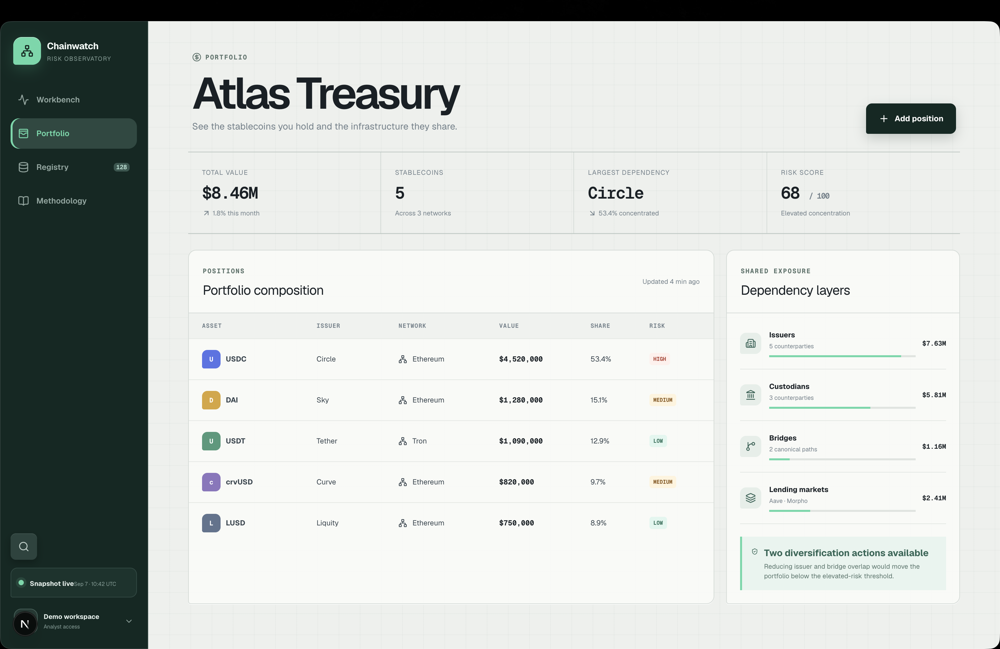

# User-rejected UI example

Read before designing a new shell or substantial redesign, and compare again during final visual review.

Image path relative to this skill: `assets/rejected-chainwatch-ui.png`. Open it using the available image viewer; a Markdown link alone does not mean you have inspected the image. When image viewing is unavailable, use the observations below and disclose that the image comparison was not performed. This is reference material for the agent, not an asset to place in the generated app. Show it to the user when they ask to see the rejected example.

The user explicitly rejected this screenshot. Do not reproduce its combined sidebar and page treatment or present a recolored version as a new design. This is a recorded user preference, not a claim that every dark sidebar, rounded control, or large heading is inherently wrong.

## What to avoid repeating

- The sidebar's broad rounded active tile, bright leading stripe, and accent-colored label compete for attention. Use a quieter selected treatment appropriate to the chosen beUI component and keep focus visually distinct from selection.
- A few navigation entries occupy the top of a tall dark slab while disconnected utility boxes accumulate at the bottom. Choose intentional navigation and utility groups, with spacing and weight that relate to the content. Empty space alone is not a defect; filling it with extra widgets is not a correction.
- The snapshot footer packs the status label and timestamp into a cramped line. Give metadata its own legible space, wrap or simplify it, and test long labels. Check account and utility controls at reduced height and increased text size.
- The oversized portfolio heading consumes disproportionate attention in an operational view. Set title scale and header spacing around the user's working task and data density.
- The graph-paper background extends behind ordinary text and tables without explaining data. Use a quiet content surface; reserve grids for canvases where they support positioning or spatial interpretation.
- Large outlined panels leave substantial unused space beneath short content. Let panel height follow content unless alignment, scrolling, or a real empty/loading state requires otherwise.

## Required sidebar and whole-page review

Inspect the actual rendered shell early, before duplicating it across routes. Evaluate the sidebar on its own and beside the content. Check brand/header proportions, row rhythm, icon alignment, label readability, selected versus focus states, group spacing, footer wrapping, and scroll behavior. Inspect expanded/collapsed modes when implemented and mobile navigation with real route names.

Compare the entire view for header scale, content density, empty space, competing accents, unnecessary surface decoration, and table readability. Fix the composition if it repeats the rejected combination; substituting one library button or changing green to another color does not address it.

For each issue found, record the route and state, visible symptom, correction, and result after re-rendering. Do not assert the sidebar is clean solely because it came from beUI. No known clipping, overlapping text, ambiguous navigation, or recurrence of this rejected composition may remain unreported at completion.
